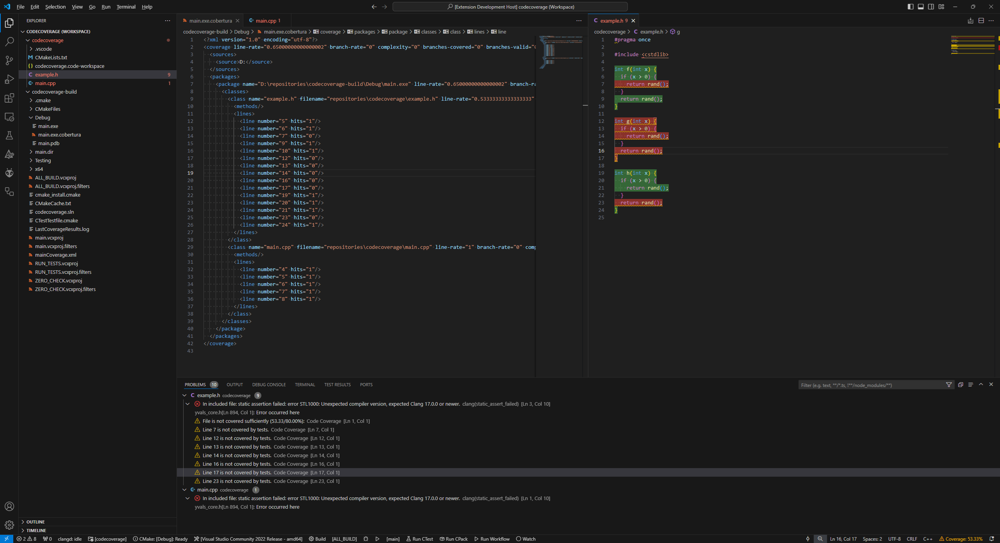

# Cobertura Code Coverage Highlighter

Cobertura code coverage highlighter parsing [OpenCppCoverage](https://github.com/OpenCppCoverage/OpenCppCoverage) generated cobertura XML files and highlighting hit and missed lines in the C++ source files.

